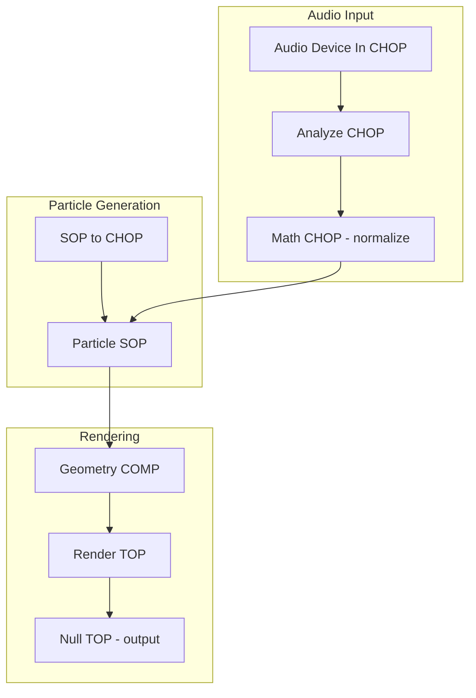

# 🎨 TD Network Creator Mode

A specialized mode for [Roo-Cline](https://github.com/RooVetGit/Roo-Cline) that creates TouchDesigner networks using the TD MCP Server exclusively for accurate operator information.

## Overview

The TD Network Creator mode was designed to generate TouchDesigner networks through Python scripts that can be executed in textport. It is supposed ensure accuracy by consulting the TD MCP Server for all TouchDesigner-related details, never relying on assumptions or training data. BUT IT DOESN'T! The big problem I'm having right now is getting any LLM whether its ChatGPT-5 or Claude Opus/Sonnet or Gemini to not forget that it's supposed to go to the TD MCP Server 'well' for every detail of the network its creating. I can get it to do some very basic stuff but once it gets a little complicated it just starts falling back to the data it was trained on rather than the MCP server. 

*****I consider this project a failure, for now. I'm still trying new things and I'll update it if I can get it working properly or find some other method.****

## Features

### Core Capabilities
- **Resolution Selection**: Always starts by asking about output resolution (4K, 1080p, 720p, or custom)
- **Interactive Clarification**: Asks clarifying questions with a "continue without prompting" option
- **TD MCP Server Integration**: Exclusively uses TD MCP Server for all operator details
- **Line-by-Line Validation**: Validates every generated line against TD MCP Server data
- **Python Script Generation**: Creates clean, executable Python scripts for textport

### Advanced Features

#### Performance Optimization
- Network bottleneck analysis
- Cook dependency optimization
- GPU vs CPU operator recommendations
- Resolution and bit depth optimization
- Instancing opportunities identification

#### Template System
- Common network patterns (feedback loops, audio reactive, particle systems)
- Modular, reusable components
- Proper container organization
- Standardized input/output structures

#### Visual Documentation
- **Automatic Mermaid Diagrams**: Generates flow diagrams for every network
- **Multiple Export Formats**: PDF, SVG, PNG support
- **Comprehensive Visualization**: Shows operators, connections, hierarchies, and data flow
- **Conversion Scripts**: Includes scripts for diagram export

#### Network Validation
- Circular dependency checking
- Parameter range and type validation
- Resolution consistency verification
- Color space validation
- Deprecated operator warnings

#### Multiple Output Formats
- Main production script
- Simplified learning version
- Extended version with optimizations
- Debug version with logging
- Modular version for integration

#### GLSL Shader Support
- Automatic GLSL shader generation and validation
- TouchDesigner-specific GLSL syntax compliance
- Multiple shader templates (fragment, compute, multi-pass)
- GLSL debugging helpers and error checking
- Performance optimization recommendations

## GLSL Shader Development

The TD Network Creator mode provides comprehensive support for GLSL shader development within TouchDesigner networks. This feature ensures that generated shaders follow TouchDesigner's specific GLSL conventions and best practices.

### Overview of GLSL Support

The mode automatically generates GLSL shaders that are fully compatible with TouchDesigner's rendering pipeline. It validates shader syntax, ensures proper uniform declarations, and follows TD-specific conventions for texture sampling and output formatting.

### TouchDesigner GLSL Conventions

- Proper use of `sTD2DInputs[]` array for texture inputs
- Correct uniform declarations with TD-specific naming
- Resolution-aware sampling with automatic coordinate normalization
- Multi-output support for complex shader pipelines

### Available Shader Templates

1. **Fragment Shaders**: Standard 2D image processing and effects
2. **Compute Shaders**: GPU-accelerated parallel computations
3. **Multi-Pass Shaders**: Complex effects requiring multiple render passes
4. **Feedback Shaders**: Temporal effects with proper buffer management

### Debugging Techniques

- Automatic error checking with line-specific feedback
- Visual debugging helpers (color-coded outputs)
- Performance profiling recommendations
- Common pitfall warnings

For detailed GLSL best practices and advanced techniques, see the [TD GLSL Best Practices](TD_GLSL_Best_Practices.md) document.

## Installation

1. Ensure you have [Roo-Cline](https://github.com/RooVetGit/Roo-Cline) installed
2. Copy the mode configuration to your workspace or global settings
3. Install the [TD MCP Server](https://github.com/your-username/TD-MCP) if not already installed

### Option 1: Workspace Installation
Create a `.roomodes` file in your workspace root:

```yaml
customModes:
  - slug: td-network-creator
    # ... (see td-network-creator.yaml for full configuration)
```

### Option 2: Global Installation
Add to your global custom modes file at:
- Windows: `%APPDATA%\VSCodium\User\globalStorage\rooveterinaryinc.roo-cline\settings\custom_modes.yaml`
- macOS: `~/Library/Application Support/VSCodium/User/globalStorage/rooveterinaryinc.roo-cline/settings/custom_modes.yaml`
- Linux: `~/.config/VSCodium/User/globalStorage/rooveterinaryinc.roo-cline/settings/custom_modes.yaml`

## Usage

1. Switch to TD Network Creator mode in Roo-Cline
2. Describe the TouchDesigner network you want to create
3. Select your desired output resolution
4. Answer any clarifying questions (or choose to continue without prompting)
5. Receive your generated Python script and visual documentation

### Example Workflow

```
User: Create a particle system with audio reactivity
Bot: What resolution should the output be?
     1. 4K (3840x2160)
     2. 1080p (1920x1080)
     3. 720p (1280x720)
     4. Custom (you'll specify)
User: 2
Bot: What audio input source would you like to use?
     1. Microphone input
     2. Audio file playback
     3. System audio capture
     4. Continue without prompting me again, use your best judgment
...
```

### GLSL Examples

The mode includes several GLSL shader examples demonstrating various techniques:

1. **glsl_reaction_diffusion.py** - Gray-Scott reaction-diffusion system
   - Implements a complex reaction-diffusion simulation
   - Demonstrates compute shader usage for iterative processes
   - Includes parameter controls for pattern variation

2. **glsl_color_gradient.py** - Multi-type gradient generator
   - Shows various gradient generation techniques
   - Supports linear, radial, angular, and diamond gradients
   - Demonstrates efficient color interpolation in GLSL

3. **glsl_multi_input_blend.py** - Advanced blending with 16 blend modes
   - Implements Photoshop-style blend modes in GLSL
   - Handles multiple texture inputs efficiently
   - Includes opacity and mask support

## Output Example

The mode generates multiple files:

### 1. Python Script (`particle_audio_network.py`)
```python
# TouchDesigner Network: Audio Reactive Particle System
# Resolution: 1920x1080
# Generated by TD Network Creator Mode

# Clear existing network (optional)
# op('/').deleteAllChildren()

# Create audio input
audio_in = op('/').create(audiodevin, 'audio_input')
audio_in.par.device = 0  # Default audio device

# Create audio analysis
audio_analyze = op('/').create(analyzeChop, 'audio_analyzer')
audio_analyze.par.function = 'rms'
audio_in.outputConnectors[0].connect(audio_analyze.inputConnectors[0])

# ... (rest of network creation)
```

### 2. GLSL Shader Files (`particle_audio_shader.glsl`)
```glsl
// TouchDesigner GLSL Fragment Shader
// Audio Reactive Particle Visualization

uniform float uTime;
uniform float uAudioLevel;

out vec4 fragColor;

void main() {
    vec2 uv = gl_FragCoord.xy / uTD2DInfos[0].res.xy;
    // Shader implementation...
    fragColor = vec4(color, 1.0);
}
```

### 3. Mermaid Diagram (`particle_audio_network.mmd`)


### 4. Conversion Scripts
- `convert_to_pdf.bat` / `convert_to_pdf.sh`
- `convert_to_svg.bat` / `convert_to_svg.sh`

## Requirements

- TouchDesigner (099 or later recommended)
- TD MCP Server installed and running
- Node.js (for Mermaid diagram conversion)
- Optional: mermaid-cli for direct conversion
- VS Codium GLSL extensions for shader syntax highlighting and validation

## Contributing

Contributions are welcome! Please feel free to submit issues or pull requests.

## License

MIT License - see LICENSE file for details

## Acknowledgments

- Built for [Roo-Cline](https://github.com/RooVetGit/Roo-Cline)
- Powered by [TD MCP Server](https://github.com/your-username/TD-MCP)
- TouchDesigner by Derivative Inc.
